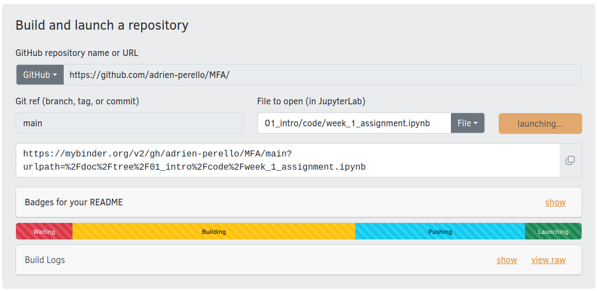
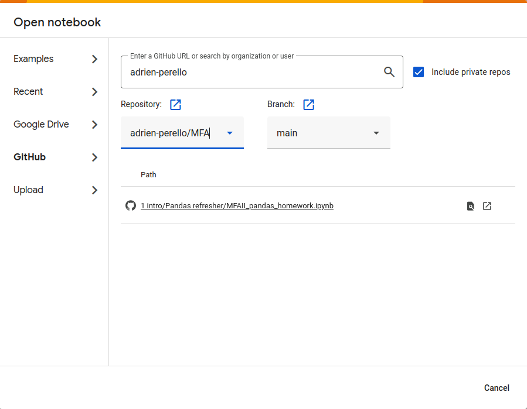
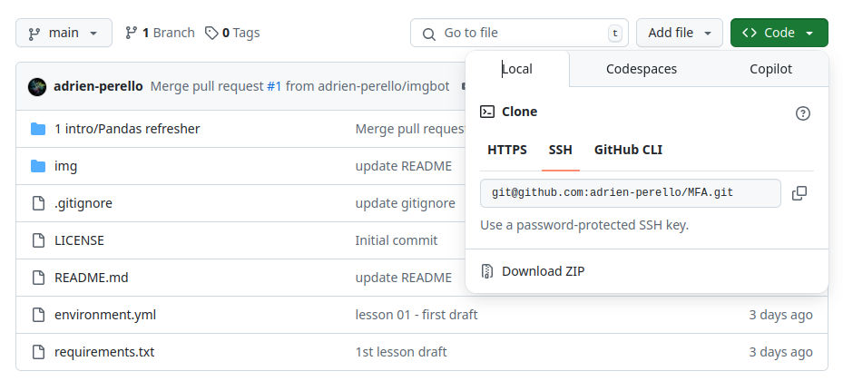
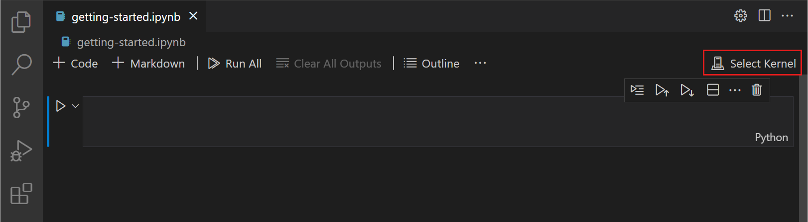

# Computer Science Crash Course

Learn the basics of Computer Science and python with Jupyter notebooks.

## Content

- [I. Introduction to Python](./01_introduction-to-python)
- [II. Scientific Computing](02_scientific-computing-libraries)
- [III. Data Structures](./03_data-structures-and-algorithms)
- [IV. Exercises](04_exercises)
<!-- - [V. Software Development](05_software-development) -->

***

## How to Run the Notebooks

### Online

If you don’t want to install anything, you can run the notebooks using a web-based platform like Binder or Google Colab.

#### via Binder

- Go to [Binder](https://mybinder.org/).
- Enter the GitHub repository URL in the "GitHub repository name or URL" field.
- Specify the branch and the file to open (optional)
- Click on "Launch"



> **Note**: It is recommended that you only open the desired notebook, as building a Docker image can be slow (see screenshot qbove)


#### via Google Colab (requires a Google account)

- Go to [Colab](https://colab.research.google.com/)
- Click on File > Upload notebook
- Select Github and specify the URL



***

### Local installation (Recommended)

**1. Install an Environment Management Tool**

  - install [mamba](https://mamba.readthedocs.io/en/latest/) (faster and more efficient than Conda)
  - or [anaconda](https://www.anaconda.com/products/individual) (popular for Data Science, but slower)


**2. Download the Repository**

  - Download as zip (click on Code > Download zip) and extract it to a preferred location on your computer.
  - or, [clone it](https://docs.github.com/en/repositories/creating-and-managing-repositories/cloning-a-repository) if you are tech savy and have git installed




**3. Set Up a Virtual Environment**

- Navigate to the cloned/downloaded repository folder (where the `environment.yml` is located)
- Open a Terminal (MacOS, Linux) or Command Prompt (Windows) from inside that specific directory
  - Linux: Right-click and select `Open in Terminal`
  - MacOS: Right-click and select `New Terminal at Folder`
  - Windows: Click on the address bar, type `cmd`, and press Enter.
- Run the following command:
    ```bash
    mamba env create --file environment.yml
    ```

> **Notes:**
> - replace `mamba` with `conda` if you have anaconda instead.
> - If you’re not inside the correct directory, you can specify the full path: `--file /path/to/environment.yml`
> - The environment name is already specified in the `environment.yml` file (default is `ipynb-env`), but you can set your own name using: `mamba env create --name <MY-ENV-NAME> --file environment.yml`


**4. Running Jupyter Notebooks**

- Option 1: Using Jupyter Notebook
  - activate the virtual environment by running the following command in the Terminal: `mamba activate <MY-ENV-NAME>`
  - launch jupyter by running the following command in the Terminal: `jupyter lab` (or `jupyter notebook`)


- Option 2: Using VS Code
    - Install [VS Code](https://code.visualstudio.com/download)
    - Open VS Code and go to File > Open Folder
    - Open a Jupyter Notebook (`.ipynb` file)
    - make sure to select [the virtual environment (i.e. Kernel)](https://code.visualstudio.com/docs/datascience/jupyter-notebooks) where the Jupyter package is installed

