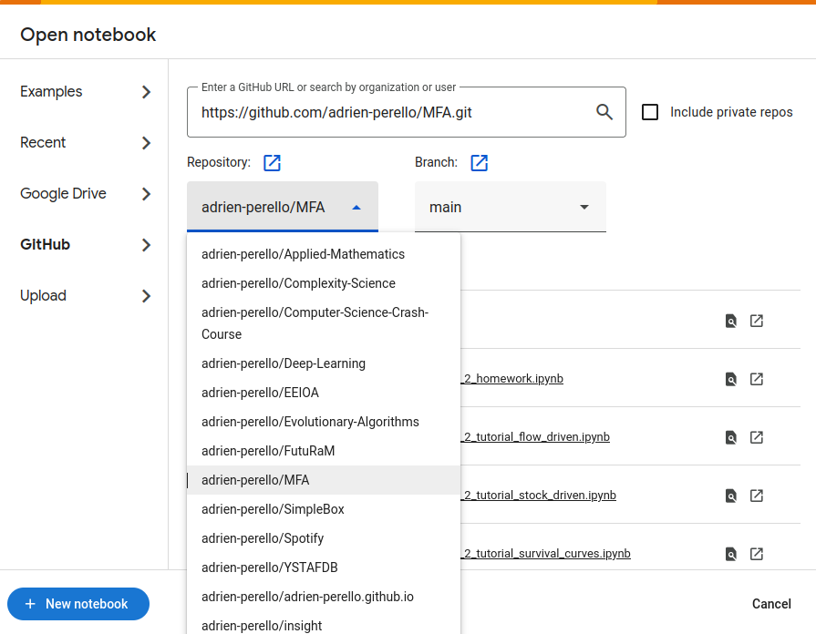

# Material Flow Analysis II


## How to Run the Notebooks

### Local installation (Recommended)

**1. Install an Environment Management Tool**

  - [Donwnload anaconda](https://www.anaconda.com/products/individual) and follow the installation instructions for your operating system.


**2. Download the Repository**

  - Click on **Code > Download ZIP**
  - **Extract the ZIP file** to a preferred location on your computer.
  - or, [clone it](https://docs.github.com/en/repositories/creating-and-managing-repositories/cloning-a-repository) (instead of ZIP download) if you are tech savy and have git installed


**3. Set Up a Virtual Environment**

- **Option 1:** Using the Graphical User Interface
  - Open **Anaconda Navigator** and click on Environments in the left panel
  - **[Select import](https://www.anaconda.com/docs/tools/anaconda-navigator/tutorials/manage-environments)** (at the bottom) and navigate to the cloned/downloaded repository folder
  - **Select** the `environment.yml` file
  - **Enter a name** for the new environment, or use the existing name (default is `dmfa`)


- **Option 2:** Using the Command Line
  - **Navigate to the cloned/downloaded folder** (where the `environment.yml` is located)
  - **Open a Terminal** (MacOS, Linux) or **Command Prompt** (Windows) from inside that specific directory
    - Windows: Click on the address bar in File Explorer, type `cmd`, and press Enter.
    - MacOS: Right-click and select `New Terminal at Folder`
    - Linux: Right-click and select `Open in Terminal`
  - **Run the following command** to create the environment:
    ```bash
    conda env create --file environment.yml
    ```
    or
    ```bash
    conda env create --name MY-ENV-NAME --file environment.yml
    ```  
  
  
> **Notes:**
> - The default name of the environment is `dmfa`
> - If you’re not inside the correct directory, you can specify the full path: `--file /path/to/environment.yml`


  
  
**4. Running Jupyter Notebooks**

- **Option 1:** Using the Graphical User Interface
  - Open **Anaconda Navigator** 
  - Click on the **Environments tab** in the left panel
  - **[Select your virtual environment](https://www.anaconda.com/docs/tools/anaconda-navigator/tutorials/manage-environments)** to activate it (e.g., `dmfa` or your custom name).
    - Please note that it might take a few minutes to load.
    - The environment has successfully activated when the name appears in green with a green arrow
  - **Click Launch** on Jupyter Notebook or JupyterLab (in the Home tab).

> **Notes:**
> - You can also launch Jupyter by clicking on the green arrow button and selecting **Open with Jupyter Notebook** in the dropdown menu


  
- **Option 2:** Using the Command Line
    - **Launch a terminal/command prompt** (or the "Anaconda Prompt" app)
    - **Run the following command** to activate the virtual environment:
      ```bash
      conda activate dmfa
      ```
      or
      ```bash
      conda activate MY-ENV-NAME
      ```
    - **Run the following command** to launch jupyter:
      ```bash
      jupyter lab
      ``` 
      or
      ```bash
      jupyter notebook
      ```
  
- **Option 3:** Using VS Code
    - Install **[VS Code](https://code.visualstudio.com/download)**
    - **Open VS Code** and go to **File > Open Folder**
    - **Open a Jupyter Notebook** (`.ipynb` file)
    - **Select [the virtual environment (i.e. Kernel)](https://code.visualstudio.com/docs/datascience/jupyter-notebooks)** where the Jupyter package is installed


***


### Online

If you don’t want to install anything, you can run the notebooks using a web-based platform like Binder or Google Colab.

#### via Binder

- Go to [Binder](https://mybinder.org/).
- Enter the GitHub repository URL in the "GitHub repository name or URL" field.
- Specify the branch and the file to open (optional)
- Click on "Launch"


> **Note**: It is recommended that you only open the desired notebook, as building a Docker image can be slow (see screenshot above)


#### via Google Colab (requires a Google account)

- Go to [Colab](https://colab.research.google.com/)
- Click on File > Upload notebook
- Select Github and specify the URL


